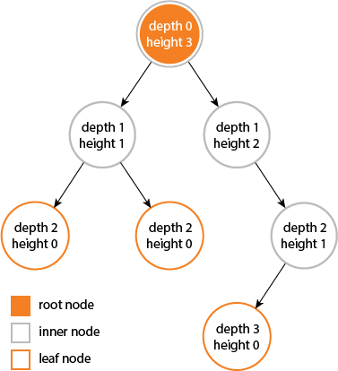

# In your own words, describe what a Binary Search Tree (BST) is. In addition, describe two important properties of a BST: depth and height. How are they different?
> An binary search tree is an data structure that contains values in an sorted manner, the binary tree keeps data organised in an sorted manner when data is added and removed, this tree consists of nodes with two children, the left stores values that are lower value than the parent nodes value and the right nodes store the higher values.

> The height of an tree or node is the number of edges between that node and from the longest or lowest point of the tree, an depth of an tree / node is the number of edges from the root of the tree.

I found this picture very helpful in understanding the differences 

image from Ščerbák, G. (2024). What is the difference between depth and height in a tree? [online] Stack Overflow. Available at: https://stackoverflow.com/questions/2603692/what-is-the-difference-between-depth-and-height-in-a-tree [Accessed 19 Sep. 2024].

Geeksforgeeks (2015). Binary Search Tree - GeeksforGeeks. [online] GeeksforGeeks. Available at: https://www.geeksforgeeks.org/binary-search-tree-data-structure/.

# In your own words, describe how an algorithm to find an item in a Binary Search Tree works.
> Starting at the root of the tree, the algorithm would check if the key is the same as that of the key / value that the algorithm is checking for, if not the algorithm would then check if the current nodes value is lower or higher than that of the key, if lower the tree would go to the next node to the left, if the key is higher it would then go to the right, this would continue until the node with the keys value is found or the end of the tree is reached.

# In your own words, describe what a balanced BST is. 
> An balanced binary search tree is an tree where the height of the values / nodes on the left and the height of the nodes / values on the right do not differ by any more than one.

www.programiz.com. (n.d.). Balanced Binary Tree. [online] Available at: https://www.programiz.com/dsa/balanced-binary-tree.

